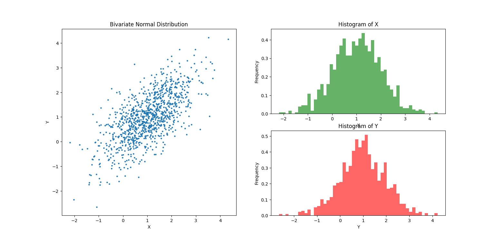
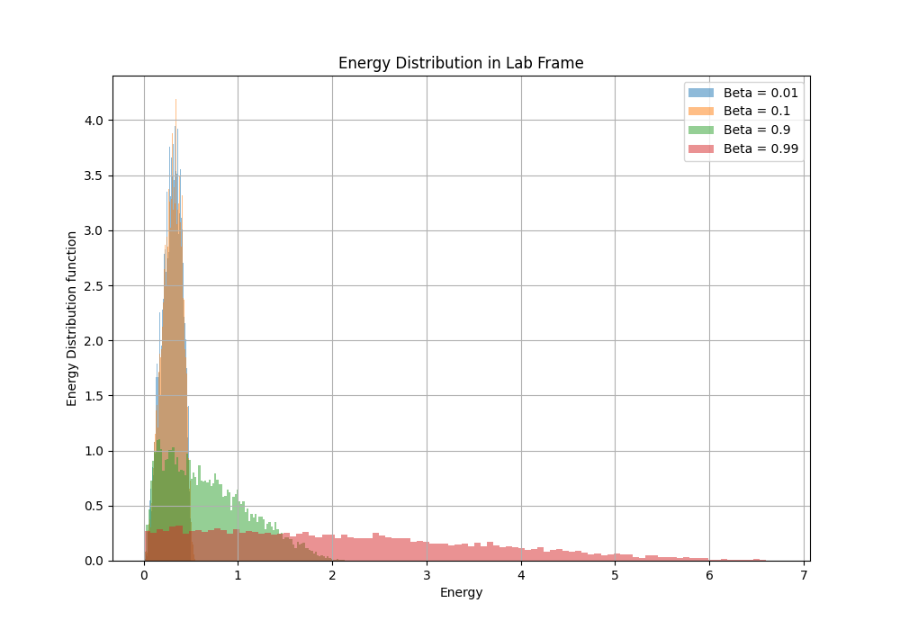

# Monte Carlo Simulations – Bivariate Sampling & Muon Decay

This repository contains two Monte Carlo-based simulation projects developed as part of the *Computational Physics* coursework at BITS Pilani.

---

## 📌 1. Bivariate Sampling using Monte Carlo Techniques

###  Objective

To generate i.i.d. samples from a **bivariate normal distribution** with specified mean vector `μ` and covariance matrix `Σ` using Monte Carlo methods.

###  Methodology

- Generate standard normal samples using the **Box-Muller Transform**.
- Use **Cholesky decomposition** to transform `Z ~ N(0, I)` into `X ~ N(μ, Σ)` via `X = μ + AZ`.
- Support for both bivariate and multivariate sampling (tested for `n=2`).

###  Features

- Functions to generate, transform, and visualize bivariate distributions.
- Manual implementation of Cholesky decomposition for educational transparency.
- Visualization using scatter plots and marginal histograms.

### 🖥 Example


bivariate_normal(1, 1, 1, 1, 0.7, 1000, plot=True)

## 📊 Output Visualization

Below is the plot showing how the neutrino energy distribution shifts for increasing values of β:




# Muon Neutrino Energy Distribution – Lab Frame Simulation

This project uses **Monte Carlo methods** to simulate the **energy distribution of neutrinos** in the **lab frame** resulting from **muon decay**, incorporating relativistic effects due to Lorentz boosts.

---

## 🎯 Objective

To estimate the **lab-frame energy distribution** \( φ'(E') \) of neutrinos emitted during the decay of a **relativistic muon** moving along the x-axis, for various boost factors β. The project visualizes how this distribution changes for:

- β = 0.01 (non-relativistic)
- β = 0.1 (moderate speed)
- β = 0.9 (relativistic)
- β = 0.99 (ultra-relativistic)

---

## 🧠 Physical Background

In the **muon rest frame**, the energy spectrum of the emitted neutrino follows:

\[
φ(E) = 12 \cdot \frac{E}{E_{\text{max}}^2} \cdot \left(1 - \frac{E}{E_{\text{max}}}\right)
\]

- \( E_{\text{max}} = M_μ / 2 \) is the maximum energy the neutrino can have.
- The emission is **isotropic in 3D** (uniformly distributed over a sphere).

To transform this to the **lab frame**, the energy is boosted using:

\[
E' = \gamma E (1 + β \cosθ)
\]

where:
- \( β = v/c \), the velocity of the muon in units of speed of light  
- \( γ = \frac{1}{\sqrt{1 - β^2}} \) is the Lorentz factor  
- \( θ \) is the angle between the muon’s direction of motion and the neutrino emission direction

---

## 🛠️ Methodology

1. **Sample `E`**:  
   Use **rejection sampling** to generate energies from the rest-frame probability density function \( φ(E) \).

2. **Sample `θ` isotropically**:  
   Generate uniform points on a sphere to simulate isotropic emission in 3D. This is done by:
   - Sampling `cosθ` uniformly from [-1, 1]
   - Sampling `φ` uniformly from [0, 2π] (for completeness)

3. **Compute `E′`**:  
   Transform rest-frame energies using the Lorentz boost formula.

4. **Plot results**:  
   Estimate and visualize the energy distributions \( φ′(E′) \) for the four β values in a **single comparative plot**.

---

## 📊 Output Visualization

Below is the plot showing how the neutrino energy distribution shifts for increasing values of β:


---

## 🧪 Requirements

- Python 3.x  
- NumPy  
- Matplotlib  

Install required packages using:

```bash
pip install numpy matplotlib
